<center><h1>语法分析设计方案</h1></center>

本次实验由三个部分组成：设计AST， 实现Simple LALR(2)自动机的生成，实现Simple LALR(2)语法分析算法。

## 抽象语法树

**说明：**

1. 每个图中都标记了语法范畴的名字，同时图中的方形节点表示根节点。

2. 根节点的内容为` <范畴名字> [范畴子类型]: 节点属性`。其中节点属性可为元组（括号表示），可选项（方括号表示）。

3. 叶节点的形式可能为：一般节点（椭圆框），重复节点（节点内容包含省略号）和可选节点（虚线框表示）。例， `Expression`范畴的`CallKind`子类型节点，其属性为一个标识符，叶节点从第二项开始可选且循环：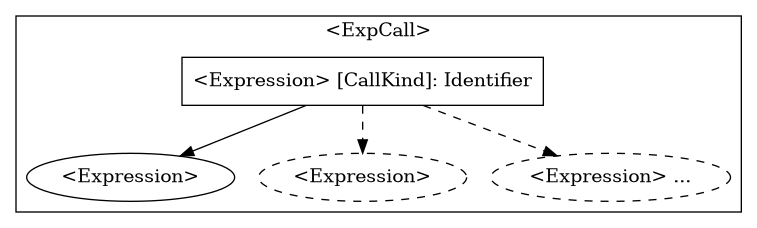

4. 所有节点的结构如下，以`<Expression>`中的调用方法节点`mc.start(100, 10)`为例：

   ```javascript
   const node = {
   	name: "<Expression>",
   	type: types.ExpType,
   	kind：types.ExpKinds.CallKind,
   	attr: "start",
   	child: [ "mc", "100", "10" ],
   }
   ```
   
5. 一个完整的`AST`如下（AST图中为了方便检查，省略了类型Type）：

   ```
   <Goal>[GoalType]
   ├── <MainClass>[MainClassType]: Main, args
   │   └── <Statement>[StateType, StateKind]
   │       ├── <Statement>[StateType, AssignKind]: mc
   │       │   └── <Expression>[ExpType, NewIdKind]: MyClient
   │       ├── <Statement>[StateType, IfKind]
   │       │   ├── <Expression>[ExpType, AddKind]
   │       │   │   ├── true
   │       │   │   └── false
   │       │   ├── <Statement>[StateType, StateKind]
   │       │   │   └── <Statement>[StateType, AssignKind]: mc
   │       │   │       └── <Expression>[ExpType, NewIdKind]: MyClient
   │       │   └── <Statement>[StateType, StateKind]
   │       │       └── <Statement>[StateType, AssignKind]: mc
   │       │           └── <Expression>[ExpType, NewIdKind]: MyClient
   │       └── <Statement>[StateType, WhileKind]
   │           ├── <Expression>[ExpType, NotKind]
   │           │   └── false
   │           └── <Statement>[StateType, StateKind]
   │               └── <Statement>[StateType, AssignKind]: handle
   │                   └── <Expression>[ExpType, CallKind]: start
   │                       ├── mc
   │                       ├── 10
   │                       └── 10
   ├── <ClassDeclaration>[ClassDecType]: NewHappend
   │   └── <MethodDeclaration>[MethodDecType]: int, main2
   │       ├── <Argument>[ArgType]: int[], args
   │       ├── <VarDeclaration>[VarDecType]: int, mc
   │       ├── <VarDeclaration>[VarDecType]: int, handle
   │       ├── <Statement>[StateType, AssignKind]: mc
   │       │   └── <Expression>[ExpType, NewIdKind]: MyClient
   │       ├── <Statement>[StateType, WhileKind]
   │       │   ├── <Expression>[ExpType, NotKind]
   │       │   │   └── false
   │       │   └── <Statement>[StateType, StateKind]
   │       │       └── <Statement>[StateType, AssignKind]: handle
   │       │           └── <Expression>[ExpType, CallKind]: start
   │       │               ├── mc
   │       │               ├── 488
   │       │               └── 388
   │       └── <Expression>[ExpType, BraKind]
   │           ├── mc
   │           └── 0
   ├── <ClassDeclaration>[ClassDecType]: Client
   │   ├── <VarDeclaration>[VarDecType]: int, in
   │   ├── <VarDeclaration>[VarDecType]: int, out
   │   ├── <VarDeclaration>[VarDecType]: int[], messagelist
   │   ├── <VarDeclaration>[VarDecType]: int, index
   │   ├── <MethodDeclaration>[MethodDecType]: boolean, init
   │   │   ├── <Statement>[StateType, AssignKind]: index
   │   │   │   └── 0
   │   │   ├── <Statement>[StateType, AssignKind]: messagelist
   │   │   │   └── <Expression>[ExpType, NewIntKind]
   │   │   │       └── 10
   │   │   ├── <Statement>[StateType, AssignKind]: in
   │   │   │   └── 0
   │   │   ├── <Statement>[StateType, AssignKind]: out
   │   │   │   └── 0
   │   │   └── true
   │   ├── <MethodDeclaration>[MethodDecType]: int, run
   │   │   ├── <Argument>[ArgType]: int, host
   │   │   ├── <Argument>[ArgType]: int, port
   │   │   ├── <VarDeclaration>[VarDecType]: int, handle
   │   │   ├── <Statement>[StateType, AssignKind]: handle
   │   │   │   └── <Expression>[ExpType, CallKind]: Juggling
   │   │   │       └── this
   │   │   └── 0
   │   ├── <MethodDeclaration>[MethodDecType]: int, getMsg
   │   │   ├── <VarDeclaration>[VarDecType]: int, tmp
   │   │   ├── <Statement>[StateType, AssignKind]: tmp
   │   │   │   └── <Expression>[ExpType, LenKind]
   │   │   │       └── messagelist
   │   │   ├── <Statement>[StateType, IfKind]
   │   │   │   ├── <Expression>[ExpType, CallKind]: isVoid
   │   │   │   │   └── this
   │   │   │   ├── <Statement>[StateType, StateKind]
   │   │   │   │   └── <Statement>[StateType, AssignKind]: tmp
   │   │   │   │       └── <Expression>[ExpType, SubKind]
   │   │   │   │           ├── tmp
   │   │   │   │           └── 1
   │   │   │   └── <Statement>[StateType, StateKind]
   │   │   │       └── <Statement>[StateType, AssignKind]: tmp
   │   │   │           └── <Expression>[ExpType, MultiKind]
   │   │   │               ├── tmp
   │   │   │               └── 2
   │   │   ├── <Statement>[StateType, IfKind]
   │   │   │   ├── <Expression>[ExpType, LtKind]
   │   │   │   │   ├── index
   │   │   │   │   └── 10
   │   │   │   ├── <Statement>[StateType, StateKind]
   │   │   │   │   ├── <Statement>[StateType, ArrAssignKind]: messagelist
   │   │   │   │   │   ├── index
   │   │   │   │   │   └── tmp
   │   │   │   │   └── <Statement>[StateType, AssignKind]: index
   │   │   │   │       └── <Expression>[ExpType, AddKind]
   │   │   │   │           ├── index
   │   │   │   │           └── 1
   │   │   │   └── <Statement>[StateType, StateKind]
   │   │   │       └── <Statement>[StateType, AssignKind]: index
   │   │   │           └── 0
   │   │   └── tmp
   │   ├── <MethodDeclaration>[MethodDecType]: boolean, isVoid
   │   │   ├── <VarDeclaration>[VarDecType]: boolean, flag
   │   │   ├── <Statement>[StateType, IfKind]
   │   │   │   ├── <Expression>[ExpType, LtKind]
   │   │   │   │   ├── 0
   │   │   │   │   └── <Expression>[ExpType, LenKind]
   │   │   │   │       └── messagelist
   │   │   │   ├── <Statement>[StateType, StateKind]
   │   │   │   │   └── <Statement>[StateType, AssignKind]: flag
   │   │   │   │       └── false
   │   │   │   └── <Statement>[StateType, StateKind]
   │   │   │       └── <Statement>[StateType, AssignKind]: flag
   │   │   │           └── true
   │   │   └── flag
   │   ├── <MethodDeclaration>[MethodDecType]: int, Juggling
   │   │   ├── <VarDeclaration>[VarDecType]: boolean, t
   │   │   ├── <VarDeclaration>[VarDecType]: int, tmp1
   │   │   ├── <VarDeclaration>[VarDecType]: int, tmp2
   │   │   ├── <VarDeclaration>[VarDecType]: int, tmp3
   │   │   ├── <Statement>[StateType, AssignKind]: tmp1
   │   │   │   └── 2
   │   │   ├── <Statement>[StateType, AssignKind]: tmp2
   │   │   │   └── 3
   │   │   ├── <Statement>[StateType, AssignKind]: tmp3
   │   │   │   └── 4
   │   │   ├── <Statement>[StateType, WhileKind]
   │   │   │   ├── <Expression>[ExpType, AndKind]
   │   │   │   │   ├── <Expression>[ExpType, ParKind]
   │   │   │   │   │   └── <Expression>[ExpType, LtKind]
   │   │   │   │   │       ├── tmp2
   │   │   │   │   │       └── tmp3
   │   │   │   │   └── <Expression>[ExpType, ParKind]
   │   │   │   │       └── <Expression>[ExpType, LtKind]
   │   │   │   │           ├── tmp1
   │   │   │   │           └── tmp2
   │   │   │   └── <Statement>[StateType, StateKind]
   │   │   │       ├── <Statement>[StateType, AssignKind]: tmp1
   │   │   │       │   └── <Expression>[ExpType, SubKind]
   │   │   │       │       ├── tmp3
   │   │   │       │       └── tmp2
   │   │   │       ├── <Statement>[StateType, AssignKind]: tmp2
   │   │   │       │   └── <Expression>[ExpType, SubKind]
   │   │   │       │       ├── tmp2
   │   │   │       │       └── tmp1
   │   │   │       ├── <Statement>[StateType, AssignKind]: tmp3
   │   │   │       │   └── <Expression>[ExpType, MultiKind]
   │   │   │       │       ├── tmp2
   │   │   │       │       └── tmp1
   │   │   │       └── <Statement>[StateType, AssignKind]: t
   │   │   │           └── <Expression>[ExpType, CallKind]: HolyLight
   │   │   │               └── this
   │   │   └── <Expression>[ExpType, MultiKind]
   │   │       ├── <Expression>[ExpType, ParKind]
   │   │       │   └── <Expression>[ExpType, AddKind]
   │   │       │       ├── tmp1
   │   │       │       └── <Expression>[ExpType, MultiKind]
   │   │       │           ├── tmp2
   │   │       │           └── tmp3
   │   │       └── <Expression>[ExpType, LenKind]
   │   │           └── messagelist
   │   └── <MethodDeclaration>[MethodDecType]: boolean, HolyLight
   │       ├── <Statement>[StateType, AssignKind]: in
   │       │   └── <Expression>[ExpType, AddKind]
   │       │       ├── in
   │       │       └── 1
   │       ├── <Statement>[StateType, AssignKind]: out
   │       │   └── <Expression>[ExpType, SubKind]
   │       │       ├── out
   │       │       └── 1
   │       ├── <Statement>[StateType, PrintKind]
   │       │   └── false
   │       └── 0
   └── <ClassDeclaration>[ClassDecType]: MyClient, Client
       └── <MethodDeclaration>[MethodDecType]: int, start
           ├── <Argument>[ArgType]: int, host
           ├── <Argument>[ArgType]: int, port
           ├── <VarDeclaration>[VarDecType]: int, handle
           ├── <Statement>[StateType, AssignKind]: handle
           │   └── <Expression>[ExpType, CallKind]: run
           │       └── this
           └── handle
   ```

   


### 化简为单节点的情况

`VarDeclaration`, `Type`和`Expression`中的单词素规则可化简为单节点，其根节点直接包含了所有的信息。

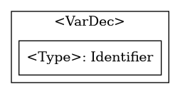

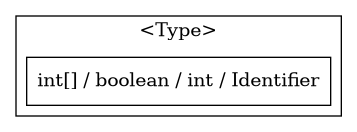

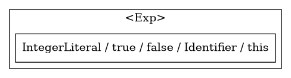


### 需要分子类的情况

`Statement`和`Expression`语法范畴包含了多个规则，每个规则都应有不同的节点结构，以达到后续操作可以彼此间区分的目的。

同时每个规则都附带一个子类型`Kind`，表示该范畴的某规则。

#### Statement


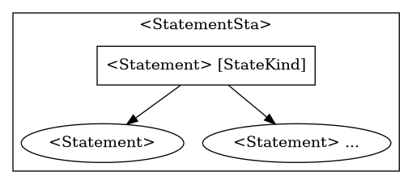

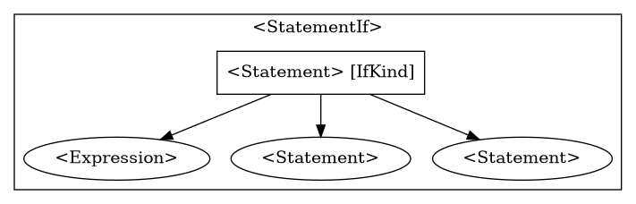

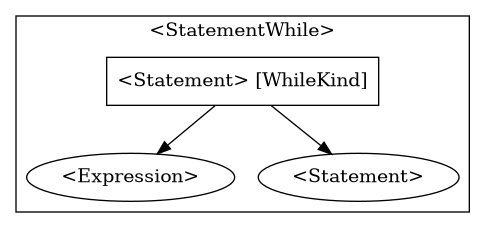

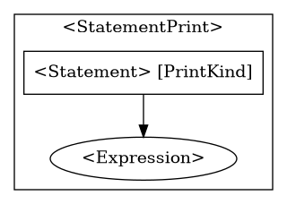

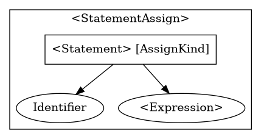

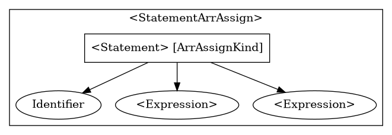

#### Expression


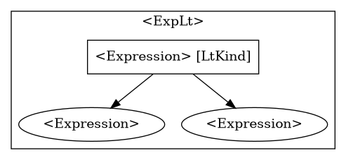

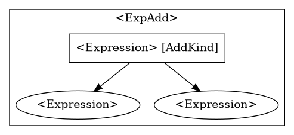

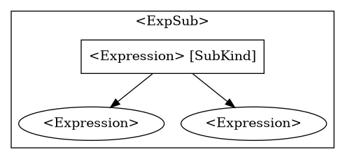

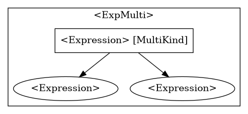

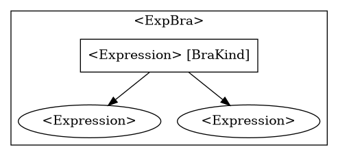

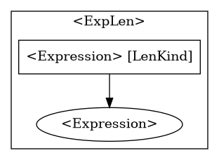


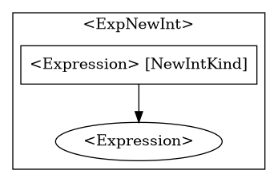

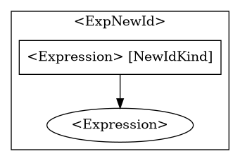

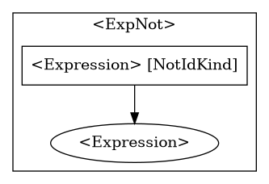

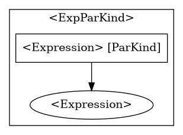


### 其他情况

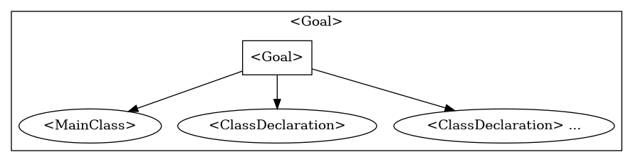

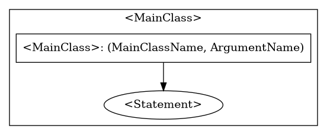

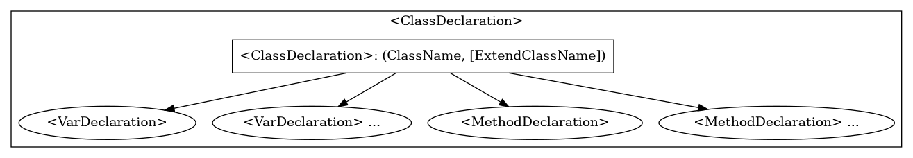

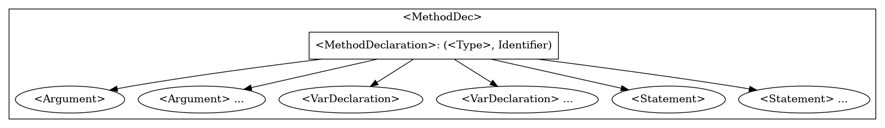


## Simple LALR(2) 实现关键点 / 本实验亮点

### Simple LALR(2) 简介

为了简单解决LALR(1)只一位下位符，导致出现不能通过优先级和结合性解决的Shift/Reduce冲突问题。

本人借鉴了SLR(1)的思路，当出现冲突问题时，只记录Shift情况的下两位token，其他的两位token简单处理成Reduce。同时简称其为Simple LALR(2)。


### 选用理由

选用Simple LALR(2)的理由：

1. LL(1)算法存在多处冲突不能直接使用；（但通过硬编码可以实现LL(2)）
2. LR(0)状态机存在大量Shift冲突不能解决，同时SLR(1)也不能直接使用；
3. LR(1)状态机状态数大于500边数更多，导致`graphviz`（基于文字圖形描述語言的画图软件）在2个小时内画不出状态机；
4. 递归下降方法效率较低，且通用性不高。
5. LALR(1)算法存在一个不能解决的Shift/Reduce冲突，所以不能仅仅只看下一个token，至少看两个token。

由于Simple LALR(2)状态机状态数量过多(300多)，所以报告中仅展示局部截图，完整图像作为附件：

较为简洁的起始状态：


普遍情况：


### Simple LALR(2) 自动机生成

本次实验中，实现了一个通过分析语法规则生成自动机的程序。通用性较强，也就是说给出任意满足语法规则文件定义的语法规则，此程序可以生成对应的Simple LALR(2)自动机、动作表和状态转移表，接下来运行语法分析得到语法分析树。最后再经过手工设计，将语法分析树转换为AST即可获得任意语言任意源代码的AST。

从解析语法规则文件，生成自动机和表，到源代码的语法分析的过程是自动化的。

后续设计新语言的语法分析，就只用在此基础上手动设计AST即可。

`builder.js`将语法规则作为输入，最后输出自动机图描述语言文件`dfa.dot`、所有状态`state.json`、

所有边`edges.json`和`action goto`表。


#### 关键点1 翻译并解析语法规则 - 从EBNF到右递归式规则

EBNF中出现的可选和重复功能难以被正确直接解析，原因是：

1. 重复较难进行状态回退，即化括号中的内容被全部Shift后，不容易确定是否应退出重复。应该再引入一个空的重复达到退出的效果。
2. 在语法分析时，难以进行Reduce。因为分析程序不知道应该回退多少次。
3. 嵌套可选和重复更难进行编码。

将EBNF翻译到右递归式，即可解决上述问题。

将文法翻译后，同时为了便于`peg`解析，我按照自己定义的文法规则编写，结果如下：

```
<Goal>      ::= <MainClass> <GoalR1>

<GoalR1>    ::= <ClassDeclaration> <GoalR1>
              | 

<MainClass> ::= class Identifier { public static void main ( String [ ] Identifier ) { <Statement> } }

<ClassDeclaration>
            ::= class Identifier <ClassDeclarationO1> { <ClassDeclarationR1> <ClassDeclarationR2> }

<ClassDeclarationO1>
            ::= extends Identifier
              | 

<ClassDeclarationR1>
            ::= <VarDeclaration> <ClassDeclarationR1>
              | 

<ClassDeclarationR2>
            ::= <MethodDeclaration> <ClassDeclarationR2>
              | 

<VarDeclaration>
            ::= <Type> Identifier ;

<MethodDeclaration>
            ::= public <Type> Identifier ( <MethodDeclarationO1> ) { <MethodDeclarationR1> <MethodDeclarationR2> return <Expression> ; }

<MethodDeclarationO1>
            ::= <Type> Identifier <MethodDeclarationO1R1>
              | 

<MethodDeclarationO1R1>
            ::= , <Type> Identifier <MethodDeclarationO1R1>
              | 

<MethodDeclarationR1>
            ::= <VarDeclaration> <MethodDeclarationR1>
              |

<MethodDeclarationR2>
            ::= <Statement> <MethodDeclarationR2>
              |

<Type>      ::= int [ ] 
              | boolean 
              | int 
              | Identifier

<Statement> ::= { <StatementR1> } 
              | if ( <Expression> ) <Statement> else <Statement>
              | while ( <Expression> ) <Statement>
              | System.out.println (  <Expression> ) ; 
              | Identifier = <Expression> ; 
              | Identifier [ <Expression> ] = <Expression> ;

<StatementR1>
            ::= <Statement> <StatementR1>
              |

<Expression>::= <Expression> && <Expression>  
              | <Expression> < <Expression>  
              | <Expression> + <Expression>  
              | <Expression> - <Expression>  
              | <Expression> * <Expression>  
              | <Expression> [ <Expression> ] 
              | <Expression> . length 
              | <Expression> . Identifier ( <ExpressionO1> ) 
              | IntegerLiteral  
              | true 
              | false 
              | Identifier  
              | this 
              | new int [ <Expression> ] 
              | new Identifier ( ) 
              | ! <Expression>  
              | ( <Expression> )

<ExpressionO1>
            ::= <Expression> <ExpressionO1R1>
              |

<ExpressionO1R1>
            ::= , <Expression> <ExpressionO1R1>
              |

```

同时定义语法规则的语法规则：

```
total
    = rules:( rule )* {
        const xs = rules
            .map(x => {
                return {[ x[0].name ]: x};
            });
        return Object.assign(...xs);
    }

rule
    = left:ruleLeft _ (endl _)* '::=' _ right:ruleRight endl* {
        return right
            .map(x => {
                x.name = left;
                return x;
            });
    }

ruleLeft
    = id {
        return text();
    }

ruleRight
    = head:(id _)+ _ endl tail:(_ '|' _ (id _)* endl)* {
        return tail
            .reduce((xs, x) => {
                xs.push( x[3].map(y => y[0]) );
                return xs;
            }, [head.map(x => x[0])])
            .map(x => {
                return {content: x, count: 0}
            });
    }

id
    = [0-9a-zA-Z<>{}\[\]\(\);,.=&\+\-\*\!]+ {
        return text();
    }

endl
    = '\n'
    / '\r\n'

_
    = [ \t]*
```

通过生成解析器，对mjava语法规则进行解析` pegjs -o syntax-parser.js syntax.peg`(这个解析过程可省略，这里使用`peg`是为了方便输入而已)。

解析结果如下：

```javascript
{
  '<Goal>': [ { content: [Array], count: 0, name: '<Goal>' } ],
  '<GoalR1>': [
    { content: [Array], count: 0, name: '<GoalR1>' },
    { content: [], count: 0, name: '<GoalR1>' }
  ],
  '<MainClass>': [ { content: [Array], count: 0, name: '<MainClass>' } ],
  '<ClassDeclaration>': [ { content: [Array], count: 0, name: '<ClassDeclaration>' } ],
  '<ClassDeclarationO1>': [
    { content: [Array], count: 0, name: '<ClassDeclarationO1>' },
    { content: [], count: 0, name: '<ClassDeclarationO1>' }
  ],
  '<ClassDeclarationR1>': [
    { content: [Array], count: 0, name: '<ClassDeclarationR1>' },
    { content: [], count: 0, name: '<ClassDeclarationR1>' }
  ],
  '<ClassDeclarationR2>': [
    { content: [Array], count: 0, name: '<ClassDeclarationR2>' },
    { content: [], count: 0, name: '<ClassDeclarationR2>' }
  ],
  '<VarDeclaration>': [ { content: [Array], count: 0, name: '<VarDeclaration>' } ],
  '<MethodDeclaration>': [ { content: [Array], count: 0, name: '<MethodDeclaration>' } ],
  '<MethodDeclarationO1>': [
    { content: [Array], count: 0, name: '<MethodDeclarationO1>' },
    { content: [], count: 0, name: '<MethodDeclarationO1>' }
  ],
  '<MethodDeclarationO1R1>': [
    { content: [Array], count: 0, name: '<MethodDeclarationO1R1>' },
    { content: [], count: 0, name: '<MethodDeclarationO1R1>' }
  ],
  '<MethodDeclarationR1>': [
    { content: [Array], count: 0, name: '<MethodDeclarationR1>' },
    { content: [], count: 0, name: '<MethodDeclarationR1>' }
  ],
  '<MethodDeclarationR2>': [
    { content: [Array], count: 0, name: '<MethodDeclarationR2>' },
    { content: [], count: 0, name: '<MethodDeclarationR2>' }
  ],
  '<Type>': [
    { content: [Array], count: 0, name: '<Type>' },
    { content: [Array], count: 0, name: '<Type>' },
    { content: [Array], count: 0, name: '<Type>' },
    { content: [Array], count: 0, name: '<Type>' }
  ],
  '<Statement>': [
    { content: [Array], count: 0, name: '<Statement>' },
    { content: [Array], count: 0, name: '<Statement>' },
    { content: [Array], count: 0, name: '<Statement>' },
    { content: [Array], count: 0, name: '<Statement>' },
    { content: [Array], count: 0, name: '<Statement>' },
    { content: [Array], count: 0, name: '<Statement>' }
  ],
  '<StatementR1>': [
    { content: [Array], count: 0, name: '<StatementR1>' },
    { content: [], count: 0, name: '<StatementR1>' }
  ],
  '<Expression>': [
    { content: [Array], count: 0, name: '<Expression>' },
    { content: [Array], count: 0, name: '<Expression>' },
    { content: [Array], count: 0, name: '<Expression>' },
    { content: [Array], count: 0, name: '<Expression>' },
    { content: [Array], count: 0, name: '<Expression>' },
    { content: [Array], count: 0, name: '<Expression>' },
    { content: [Array], count: 0, name: '<Expression>' },
    { content: [Array], count: 0, name: '<Expression>' },
    { content: [Array], count: 0, name: '<Expression>' },
    { content: [Array], count: 0, name: '<Expression>' },
    { content: [Array], count: 0, name: '<Expression>' },
    { content: [Array], count: 0, name: '<Expression>' },
    { content: [Array], count: 0, name: '<Expression>' },
    { content: [Array], count: 0, name: '<Expression>' },
    { content: [Array], count: 0, name: '<Expression>' },
    { content: [Array], count: 0, name: '<Expression>' },
    { content: [Array], count: 0, name: '<Expression>' }
  ],
  '<ExpressionO1>': [
    { content: [Array], count: 0, name: '<ExpressionO1>' },
    { content: [], count: 0, name: '<ExpressionO1>' }
  ],
  '<ExpressionO1R1>': [
    { content: [Array], count: 0, name: '<ExpressionO1R1>' },
    { content: [], count: 0, name: '<ExpressionO1R1>' }
  ]
}
```


#### 关键点2 计算起始规则的闭包

解析了语法规则后，选定起始规则`<Goal>`进行闭包运算并生成后继状态：

1. 遍历起始规则，选出下一个Token为非终结符的规则，称这个Token为`a`。
2. 确认当前闭包是否包含此规则产生的闭包。若以包含，则跳过。
3. 在全局规则中找出`a`为范畴的产生式列表。
4. 计算该列表中所有产生式的下位符。改为`First(ab)`，其中`b`是当前起始规则的全部下位符。
5. 将列表中所有产生式加入闭包中。
6. 将该闭包作为起始规则，跳至1。若没有新的产生式加入后，推出闭包运算。
7. 合并闭包中的lookahead。


#### 关键点4 计算lookahead(下位符)

闭包的计算涉及了下位符的计算，下位符是用来确定终结状态对下一个Token是否应Reduce。

所以下位符的意义是收集需要Reduce的状态的下一个Token。

那么当计算闭包的范畴时，我们记录该范畴后的Token称其为`a`。同时记录产生式的`lookehead`作为`b`。

那么下位符就是`First(ab)`。


#### 关键点5 First/Follow集

若一个符号串 u = X1 X2 ... Xn ，则 First(u) 的计算步骤如下：

> **（1）** 置 i = 1 ；
>
> **（2）** 若 i == n + 1，则将 ε 加入 First(u) ，终止计算；
>
> **（3）** 若 Xi 是终结符，则将 Xi 加入 First(u) ，终止计算；
>
> **（4）** 若 Xi 是非终结符，则将 First(Xi) - ε 加入 First(u)，
>  		4.1 若 First(Xi) 不含 ε ，则终止计算；
> 		4.2 若 First(Xi) 中含有 ε ，则置 i = i + 1 ，转到（2）。

一个语法中所有非终结符的 follow set 的计算步骤如下：

> **（1）** 将 $ 加入到 Follow(S) 中， S 为起始符号， $ 为结束符 EOF ；
>
> **（2）** 对每条形如 A -> u B v 的产生式，将 First(v) - ε 加入到 Follow(B) ；
>
> **（3）** 对每条形如 A -> u B 的产生式，或 A -> u B v 的产生式（其中 First(v) 含 ε ），将 Follow(A) 加入到 Follow(B) 。


#### 关键点6 状态回退

当闭包计算结束后，对每个闭包中的产生式进行递归式的后继状态计算。

需要注意到其中某个产生式会可能产生一个已经出现过的状态。这种现象会使状态机的计算进入死递归。

为了解决这个问题，每个计算后继状态的产生式应当被记录下来，以便后续出现相同产生式时直接指向原有的状态。这个记录过程可以简单的视为`hashValue -> stateIndex`的映射。


#### 关键点7 利用优先级和结合性消除Shift/Reduce冲突

状态机计算结束后，进行`Action`和`Goto`表的计算。

首先计算Shift的情况，这里仅需要处理自动机生层时构建的边`<start, weight, end>`，简单写入表即可。

其次进行Reduce的计算：

1. 从所有状态中过滤出终结状态，遍历之。
2. 从终结状态中找出终结规则，遍历其下位符。
3. 当`action[state][lookahead]==='Shift'`时，产生冲突 。若没有冲突，进行下一步。
4. 置`action[state][lookahead]='Reduce', goto[state][lookahead]=[name, length]`

当冲突产生时，大部分情况下， LR(1) 解析过程的 shift/reduce 冲突可以通过引入符号的优先级来解决。具体方法为：

1. 定义某些符号的优先级以及结合方式；
2. 当构造 LR(1) 的过程中出现了 shift/reduce 冲突时，即某个状态 I 中同时还有 [ A -> u.aw , c ] 和 [ B -> v. , a ] ，若已定义符号 a 的优先级，且符号串 v  中至少有一个已定义优先级的符号，则可通过以下原则确定 M[I, a] 的动作：
	1. 找到 v 中最右边的、已定义优先级的符号（也就是 v 中离 a 最近的一个已定义优先级的符号），假设为 `b` 
	2. 若 a 的优先级 **低于** b 的优先级，则： M[I, a] = **reduce** B -> v ；
	3. 若 a 的优先级 **高于** b 的优先级，则： M[I, a] = **shift** NEXT(I, a) ；
	4. 若 a 的优先级 **等于** b 的优先级，则根据 a 和 b 的结合方式：
		1. 若 a 和 b 都为左结合，则 M[I, a] = **reduce** B -> v ；
		2. 若 a 和 b 都为右结合，则 M[I, a] = **shift** NEXT(I, a)。


#### 关键点8 利用Shift情形的下两位token 消除Shift/Reduce冲突

在状态机的第20和274号状态中，存在两个规则无法用单个下位符解决的冲突。

这里简要分析冲突的产生原因。

```
产生式中存在这样一个规则
<MethodDeclaration> ::= public <Type> Identifier ( [...] ) { {<VarDeclaration>} {<Statement>} return <Expression> ; }

注意到{<VarDeclaration>} {<Statement>}是相连的。
```

也就是说在方法体中，写下`Identifier ...`。

LR(1)和LL(1)是无法分别出这是一个VarDeclaration，还是一个Statement。

比如VarDeclaration的情况： `Integer number;`

比如Statement的情况：`number = 2;`


这时向后看一位的算法就必然不能实现该文法。

现介绍Simple LALR(2)的解决方法， 比如出现冲突为：

```
A -> x y . , a		// 下位符是a，需要Reduce的情况
B -> . a b , c		// 下一个token是a，需要Shift的情况
```

1. 出现冲突时，计算下两位符: `First(bc)`其中c为下位符，b为下一位token之后的所有token。
2. 设置这个下两位符为Shift情形。
3. 设置其他下两位符为Reduce情形。


### 语法分析

#### LR(1)语法分析

语法分析涉及的数据结构是符号栈、状态栈和token列表，还有action表、goto表和全部状态列表。


#### 报错的情况

大多数编译器会将当前语句和期望token作为报错信息。

这就需要将源代码和token列表作为语法分析器的输入。

这里展示本实验的报错信息。


#### AST输出

首先展示本实验的部分ast输出信息：


默认输出至文件`syntaxOut.txt`和标准输出。